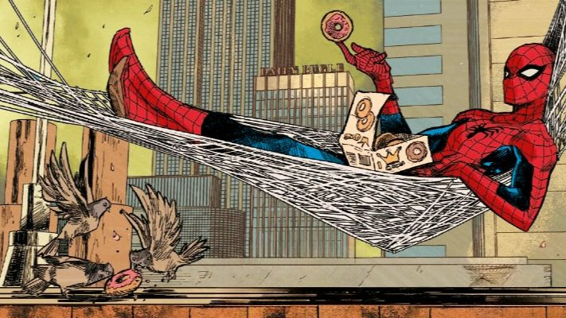
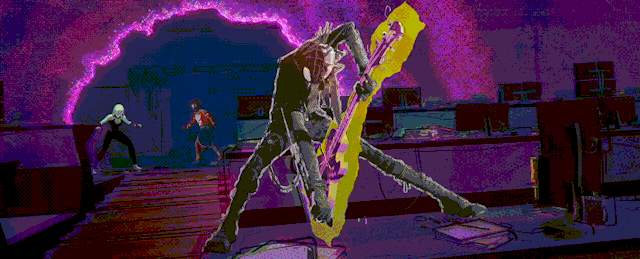

<!-- Banner Spider-Punk -->

  

<h1 align="center">🕷️🎸 Bem-vindo ao universo Rock’n’Code do <b>EduardoDias1902</b> 🕸️</h1>

  <i>"Entre riffs e linhas de código, eu balanço nas teias do desenvolvimento!"</i>

---

## 🕷️ Sobre mim
- 👨‍💻 Programador entre os riffs de **HTML, Java e JavaScript**.  
- ⚡ Explorador do mundo físico com **Arduino e ESP32**.  
- 🎶 Rockeiro de coração – fãs de **Metallica, AC/DC, Iron Maiden, Slipknot e muito mais**.  
- 🕸️ Inspiração: **Spider-Man & Spider-Punk**.  

---

## 🕸️ Skills de Programação

  

---

## 🤘 Skills Musicais & Vibe Rock
- 🎸 Sempre com um **riff de guitarra** na cabeça.  
- 🎧 Curto rock clássico, metal e punk.  
- ⚡ Energia do rock me inspira a **criar projetos intensos e cheios de criatividade**.  

  

---

## 📊 Estatísticas do GitHub

  
  

---

## 🕷️ Projetos em destaque
- 🔌 **IoT e Automação** com ESP32 e Arduino.  
- 🌐 **Sites e aplicações web** em HTML, CSS, JavaScript.  
- ☕ **Sistemas em Java** organizados em MVC.  
- 🎶 Projetos que unem **tecnologia + música**.  

---

## 🕸️ Onde me encontrar?

  
  

---

<!-- Gif final Spider-Punk -->

  

  <b>“Sou apenas um amigo da vizinhança... mas com guitarra e muito código!” 🕸️🎸</b>

